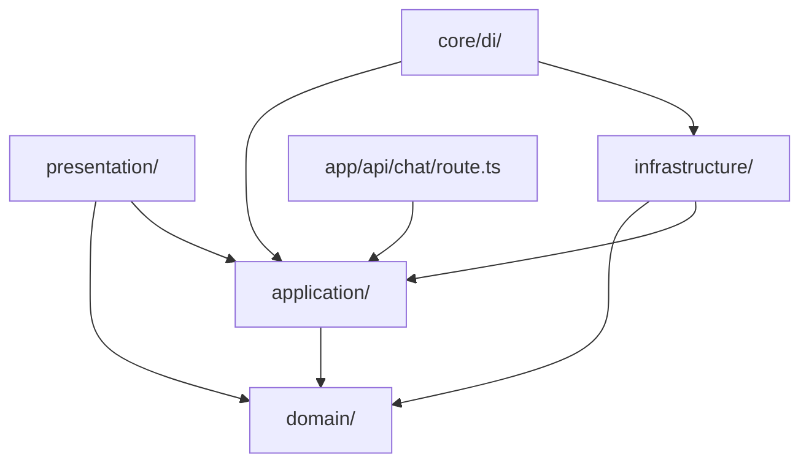
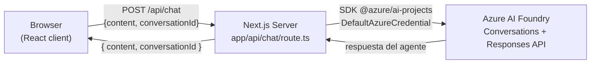

# Architecture Spine — foundry-chat-ai

## Design Paradigm

**Clean Architecture por módulos** (adaptación de hexagonal para Next.js App Router).

Cada feature es un módulo con cuatro capas internas. La regla de dependencias es la única invariante estructural que todos los módulos comparten:

```
presentation  →  application  →  domain
infrastructure  →  application / domain   (implementa interfaces)
app/  →  application  (solo composición; llama casos de uso y renderiza)
```



Mapeo paradigma → directorios:

| Capa | Directorio |
| --- | --- |
| Entidades, errores, interfaces de repositorio | `src/modules/<feature>/domain/` |
| Casos de uso, DTOs, puertos de salida | `src/modules/<feature>/application/` |
| Implementaciones externas (APIs, SDKs) | `src/modules/<feature>/infrastructure/` |
| Componentes, hooks de estado | `src/modules/<feature>/presentation/` |
| Routing y composición | `src/app/` |
| Inyección de dependencias | `src/core/di/` |
| UI genérica sin lógica de negocio | `src/shared/` |

## Invariants & Rules

### AD-1 — Regla de dependencias entre capas

- **Binds:** todos los módulos
- **Prevents:** imports de `infrastructure/` desde `domain/` o `application/`; lógica de negocio en `app/` o componentes; llamadas directas a fetch/SDK desde `presentation/`
- **Rule:** `domain/` no importa React, Next.js ni ninguna librería externa. `application/` solo importa `domain/`. `infrastructure/` implementa interfaces de `application/ports/` y puede importar SDKs externos. `app/` solo compone (recibe un caso de uso ya construido y renderiza). Cualquier import que rompa esta dirección es un error de lint.

### AD-2 — Credenciales Azure solo en servidor

- **Binds:** FR-2.1, FR-2.3, FR-2.4
- **Prevents:** `DefaultAzureCredential`, el endpoint de Foundry o cualquier secret llegando al bundle del cliente
- **Rule:** `FoundryAgentService` (infrastructure) y el Route Handler (`app/api/chat/route.ts`) son los únicos lugares donde se accede a env vars de Azure o se instancia `DefaultAzureCredential`. Ningún componente de `presentation/` ni ningún archivo importado desde el cliente puede referenciarlos.

### AD-3 — Módulo único `chat`

- **Binds:** FR-1.x, FR-2.x, FR-3.x
- **Prevents:** dividir la feature en `chat/` + `foundry/` u otro módulo separado para la integración Azure
- **Rule:** toda la lógica de la aplicación vive en `src/modules/chat/`. La integración con Azure AI Foundry es infraestructura del chat, no una feature independiente. Si en el futuro se añaden features distintas, cada una recibe su propio módulo.

### AD-4 — Errores como excepciones tipadas desde `domain/errors/`

- **Binds:** FR-2.5, todas las capas
- **Prevents:** múltiples shapes de error ad-hoc cruzando capas; Result types mezclados con excepciones
- **Rule:** `AppError` (clase base) vive en `src/modules/chat/domain/errors/`. Errores específicos (ej. `FoundryConnectionError`) extienden `AppError`. `infrastructure/` lanza estas excepciones. El Route Handler (`app/api/chat/route.ts`) es el único punto de conversión a respuesta HTTP `{ error: string }` con status code apropiado. Ninguna capa por debajo convierte errores a objetos de respuesta HTTP.

### AD-5 — `useChatSession` como único contenedor de estado del cliente

- **Binds:** FR-1.3, FR-1.5, FR-1.6, FR-1.7, FR-1.8
- **Prevents:** `useState` con estado de conversación disperso en componentes; lógica de sesión mezclada con render
- **Rule:** el hook `useChatSession` (en `presentation/hooks/`) es el único lugar donde viven `messages`, `conversationId`, e `isLoading`. Los componentes solo reciben la interfaz del hook (`{ messages, sendMessage, isLoading, startNewConversation }`) y no gestionan estado de conversación directamente.

### AD-6 — Sin persistencia fuera de memoria de sesión

- **Binds:** FR-1.6, NFR-4
- **Prevents:** agregar `localStorage`, cookies, IndexedDB o cualquier mecanismo de persistencia entre sesiones
- **Rule:** `conversationId` y el historial de mensajes viven únicamente en el estado React de `useChatSession`. Se pierden al recargar. Ningún módulo puede escribir datos de conversación fuera de la memoria del proceso del navegador.

### AD-7 — `IAgentService` vive en `application/ports/` con firmas fijas

- **Binds:** FR-2.1–FR-2.4, AD-1
- **Prevents:** que el SDK de Azure AI Projects aparezca en `domain/` o `application/`; que dos builders definan la interfaz del agente con contratos incompatibles
- **Rule:** `IAgentService` se define en `src/modules/chat/application/ports/` con exactamente estas firmas:
  ```ts
  interface IAgentService {
    startConversation(): Promise<string>;           // retorna conversationId
    sendMessage(conversationId: string, content: string): Promise<string>; // retorna texto del agente
  }
  ```
  `FoundryAgentService` en `infrastructure/foundry/` la implementa. Los casos de uso solo dependen de `IAgentService`, nunca del SDK concreto.

## Consistency Conventions

| Concern | Convention |
| --- | --- |
| Naming (archivos) | kebab-case: `send-message.use-case.ts`, `foundry-agent.service.ts`, `chat-view.tsx` |
| Naming (clases, componentes) | PascalCase: `SendMessageUseCase`, `FoundryAgentService`, `ChatView` |
| Naming (hooks) | prefijo `use` + sustantivo: `useChatSession` |
| Naming (interfaces/puertos) | prefijo `I`: `IAgentService` |
| `Message.role` | union literal `'user' \| 'assistant'`; sin variantes adicionales — la UI depende de este tipo para distinguir mensajes visualmente (FR-3.3) |
| DTOs | `ChatRequestDto { content: string; conversationId: string \| null }` · `ChatResponseDto { content: string; conversationId: string }` — definidos en `application/dtos/` |
| Error shape (HTTP) | Route Handler devuelve `{ error: string }` con status 4xx/5xx; nunca expone stack traces |
| Config / env vars | Accedidos únicamente en `infrastructure/` o `app/api/`; jamás en archivos que el cliente pueda importar |
| Auth | `DefaultAzureCredential` se instancia una vez en el constructor de `FoundryAgentService` |
| Path alias | `@/*` apunta a `./src/*` en `tsconfig.json` |
| DI | Las dependencias se componen en `src/core/di/`; el Route Handler importa el caso de uso ya construido desde allí |

## Stack

| Nombre | Versión |
| --- | --- |
| Next.js | 16.3.5 |
| React | 19.2.8 |
| TypeScript | ^5 (strict) |
| Tailwind CSS | ^4 |
| @azure/ai-projects | por verificar en npm antes de instalar [ASSUMPTION] |
| @azure/identity | por verificar en npm antes de instalar [ASSUMPTION] |

## Structural Seed

```text
src/
├── app/
│   ├── api/
│   │   └── chat/
│   │       └── route.ts          # Route Handler: único punto de entrada HTTP para el chat
│   ├── layout.tsx                 # Root layout (tema oscuro, font)
│   └── page.tsx                  # Delgado: renderiza ChatView
├── modules/
│   └── chat/
│       ├── domain/
│       │   ├── entities/
│       │   │   └── message.ts    # Message { id, role, content, createdAt }
│       │   └── errors/
│       │       └── app-error.ts  # AppError base + FoundryConnectionError
│       ├── application/
│       │   ├── ports/
│       │   │   └── i-agent-service.ts   # IAgentService { startConversation, sendMessage }
│       │   ├── dtos/
│       │   │   └── chat.dto.ts   # ChatRequestDto, ChatResponseDto
│       │   └── use-cases/
│       │       ├── start-conversation.use-case.ts
│       │       └── send-message.use-case.ts
│       ├── infrastructure/
│       │   └── foundry/
│       │       └── foundry-agent.service.ts  # implementa IAgentService via @azure/ai-projects
│       └── presentation/
│           ├── components/
│           │   ├── chat-view.tsx
│           │   ├── message-list.tsx
│           │   └── message-input.tsx
│           └── hooks/
│               └── use-chat-session.ts
├── shared/
│   └── ui/                       # Spinner, Button genéricos sin lógica de negocio
└── core/
    └── di/
        └── chat.container.ts     # Compone FoundryAgentService + casos de uso
```

Diagrama de contenedores:



## Capability → Architecture Map

| Capability | Vive en | Gobernado por |
| --- | --- | --- |
| FR-1.1–1.2 Enviar y mostrar mensajes | `application/use-cases/` + `presentation/` | AD-1, AD-5 |
| FR-1.3, FR-1.7 Ciclo de vida de conversación | `application/use-cases/` + `useChatSession` | AD-5, AD-7 |
| FR-1.4 Envío sin historial completo | `send-message.use-case.ts` + `IAgentService` | AD-7 |
| FR-1.5, FR-1.6 Estado visual efímero | `useChatSession` (React state) | AD-5, AD-6 |
| FR-1.8 Indicador de carga | `useChatSession.isLoading` | AD-5 |
| FR-2.1–2.4 Integración Azure server-side | `infrastructure/foundry/` + `app/api/chat/route.ts` | AD-2, AD-7 |
| FR-2.5 Errores de conexión visibles en UI | `domain/errors/` + Route Handler + `useChatSession` | AD-4 |
| FR-3.1–3.5 Diseño dark, responsivo | `presentation/components/` + Tailwind | AD-1 |
| NFR-1, NFR-2 Clean Architecture + TS strict | toda la estructura | AD-1, AD-3 |
| NFR-3 Config via env vars | `infrastructure/` + `app/api/` únicamente | AD-2 |

## Deferred

- **Versiones exactas de Azure SDKs**: `@azure/ai-projects` y `@azure/identity` deben verificarse contra npm antes de instalar; la spine no las pina hasta confirmar.
- **Framework de tests**: selección de jest/vitest y estrategia de mocks (repositorios fake para casos de uso) — decisión al primer story de tests.
- **Streaming de respuestas**: el Route Handler soporta `ReadableStream`; no en scope del PRD actual, pero el boundary ya lo permite.
- **Múltiples features**: si se añaden features adicionales, cada una recibe su módulo en `src/modules/<feature>/`; las convenciones de esta spine aplican por extensión.
- **Deploy y entornos**: CI/CD, contenedores, Managed Identity en producción — fuera del scope del PRD actual (proyecto de práctica). Revisar si se decide desplegar en Azure App Service u otro destino.
